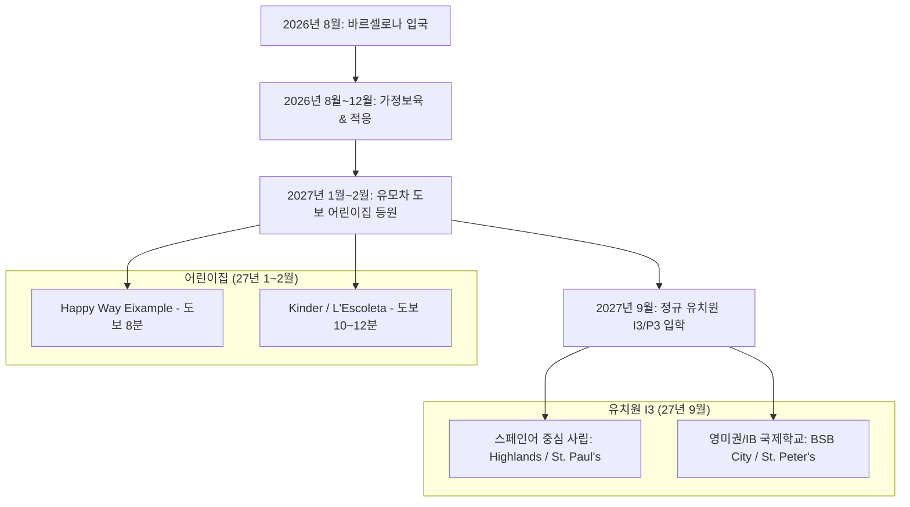
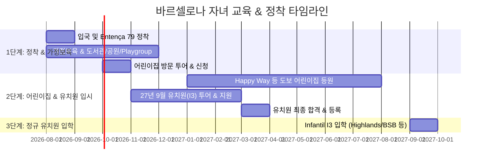

# 🇪🇸 바르셀로나 자녀 교육 & 정착 맞춤형 로드맵
**대상**: 2024년 4월생 자녀 (2026년 8월 입국 기준 만 2세 4개월)  
**거주 예정지**: 바르셀로나 Entença 79 (La Nova Esquerra de l'Eixample)  
**핵심 요구사항**: 예산 700~1,000€/월, 유모차 도보 등하원 우선, 영미권 vs 스페인어 사립학교 비교, 글로벌/스페인 장기 정착 고려  

---

## 1. 가구 조건 및 핵심 전략 요약

* **월 예산 (700~1,000€)**: 사립 트라이링구얼 학교(Highlands, St. Paul's) 및 일부 영미권 국제학교(BSB City 초등 유치원부)의 학비+급식비 범위를 충분히 충족합니다.
* **언어 & 커리어 전략**: 2024년 4월생은 만 3세(2027년 9월)에 입학하므로 스페인어/영어를 병행하는 사립/국제학교에 진학할 경우 **두 언어를 자연스러운 모국어 수준으로 동시 습득**할 수 있는 최적의 골든타임입니다.
* **동선 전략**: 2027년 1~2월 어린이집은 **Entença 79에서 유모차로 10분 내 완벽 이동 가능한 사립 기관**에 입소하고, 2027년 9월 유치원은 **아내분의 IESE MBA 동선(Pedralbes) 또는 차량 리스/셔틀버스를 연계한 명문 유치원**으로 확장합니다.

---

## 2. [요청 1 & 2] 2027년 1~2월 유모차(도보) 등하원 가능 어린이집 (Guardería)

Entença 79는 도로 턱이 낮고 인도 폭이 넓어 유모차 이동에 최적화되어 있습니다. 아빠의 육아 및 커리어 재정비(이직 준비) 시간에 맞춘 **오전반(Mitja Jornada, 09:00~13:00 / 15:00)** 운영 추천 기관입니다.

### 🏆 1순위 추천: Happy Way Eixample
* **위치**: Carrer d'Aragó 108 (Entença 79에서 **도보 7~8분, 약 550m**)
* **언어**: 스페인어 + 영어 중심 (카탈루냐어 비중 최소화)
* **특징**:
  * 바르셀로나에서 부모 만족도가 가장 높은 프리미엄 사립 Guardería.
  * **유모차 도보 동선 최상**: Entença 길에서 Aragó 길로 꺾으면 평지 직진 코스.
  * **유연한 입소**: 1~2월 중간 입소 가능, 주 2~3회 또는 주 5회 오전반 선택 가능.
  * 실시간 HD CCTV 앱 제공, 소아과 의사 정기 방문 체크, 유기농 급식.
* **비용**: 오전반 기준 약 450~650€/월 (식대 포함 여부에 따라 상이)

### 🥈 2순위 추천: L'Escoleta de l'Eixample
* **위치**: Carrer de Viladomat / Roma 근처 (Entença 79에서 **도보 9~10분**)
* **언어**: 스페인어 + 영어 이중언어
* **특징**:
  * 감각 놀이 및 몬테소리 교구 중심의 따뜻한 분위기.
  * 아빠와의 애착 적응 기간(Adaptation Period)을 1~2주간 유연하게 운영하여 중간 입소 시 아동의 스트레스가 적음.

### 🥉 3순위 추천: Kinder Barcelona (Eixample / Sant Antoni)
* **위치**: Carrer de Calabria 근처 (Entença 79에서 **도보 12~15분**)
* **언어**: 다국어 (스페인어, 영어, 독일어)
* **특징**: 국제적인 부모 비율이 매우 높아 아빠 교류(International Dads) 및 정보 공유에 유용함.

---

## 3. [요청 3] 영미권 국제학교 vs 스페인어 중심 사립학교 비교 (2027년 9월 I3 입학)

아내분의 MBA 이후 글로벌 구직(스페인/유럽/미국 등) 및 스페인 장기 정착 가능성을 고려한 비교분석입니다.

### 📊 종합 비교표

| 비교 항목 | 영미권/IB 국제학교 (International Schools) | 스페인어 중심 명문 사립학교 (Privados Trilingües) |
| :--- | :--- | :--- |
| **대표 학교** | **BSB City**, **St. Peter's**, **BFIS**, **Oak House** | **Highlands School Barcelona**, **St. Paul's School** |
| **언어 비율** | **영어 80%** + 스페인어 15% + 카탈루냐어 5% | **스페인어 50% + 영어 40%** + 카탈루냐어 10% |
| **월 예상 학비** | **900 ~ 1,200€** (I3 학년 기준) | **650 ~ 950€** (I3 학년 기준) |
| **스페인 장기 정착** | 스페인어 습득이 상대적으로 더딤 (일상 스페인어 수준) | **스페인어/영어 완벽한 2중 모국어화** (장기 정착 시 최고 유리) |
| **미국/유럽/글로벌 이직**| 미국/영국 학제 직연결, 타국 국제학교 전학 매우 용이 | IB/스페인 학제 병행으로 유럽/미국 대학 및 학교 전학 문제없음 |
| **등하원 동선** | • BSB City (Eixample/Sarrià - 대중교통/도보 가능) • St. Peter's/BFIS (차량 15분 / 셔틀) | • Highlands / St. Paul's (Pedralbes 위치 - IESE 동선상 차량 10~15분) |

---

## 4. 2027년 9월 추천 타겟 학교 상세 분석

### A. 스페인어 완벽 습득 + 글로벌 모빌리티 (추천 1순위 그룹)

#### 1. Highlands School Barcelona (Pedralbes / Esplugues)
* **특징**: Regnum Christi 계열의 명문 사립학교. 스페인어와 영어를 50:50 몰입형으로 교육.
* **장점**: 
  * 만 3세(I3) 입학 시 아이가 스페인어와 영어를 완벽하게 원어민 수준으로 구사하게 됨.
  * 스페인 내 장기 정착 시 현지 사회 및 대학/기업 적응력이 가장 뛰어남.
  * Cambridge 영어 인증 과정 및 IB 디플로마 운용으로 미국/유럽 진학 가능.
* **위치 & 동선**: IESE MBA 캠퍼스 바로 인근! 아내분의 등교길에 차/버스로 함께 이동하거나 **학교 셔틀버스(Entença/Eixample 노선 운영)** 이용 가능.
* **학비**: 약 700~850€/월 (급식비 포함, 예산 범위 완벽 부합).

#### 2. St. Paul's School (Pedralbes)
* **특징**: 바르셀로나 전통 명문 트라이링구얼 사립학교.
* **장점**: 영어, 스페인어, 카탈루냐어 3개 언어를 균형 있게 교육하며 학업 성취도가 높음.
* **학비**: 약 800~950€/월.

---

### B. 영미권/IB 글로벌 학제 (추천 2순위 그룹)

#### 1. BSB City (British School of Barcelona - Sarrià / Eixample)
* **특징**: 바르셀로나 최고의 영국 국제학교 그룹인 BSB의 도심형 캠퍼스.
* **장점**: 
  * 유모차/대중교통 접근성이 타 국제학교 대비 뛰어남 (Eixample 캠퍼스 유치부 활용 가능).
  * 미국/영국/유럽 등 훗날 어느 국가로 재이주하더라도 학제 연속성 100% 보장.
* **학비**: I3 과정 기준 약 950~1,100€/월 (예산 상한선 부근).

#### 2. St. Peter's School Barcelona (Pedralbes)
* **특징**: 바르셀로나 유일의 전 과정(PK~대입) IB World School.
* **장점**: 과학, 기술, 창의성 중심의 영미권 교육. IESE 바로 옆 위치.
* **학비**: 약 1,000~1,200€/월.

---

## 5. 등하원 수단별 실행 가이드

### 🚶‍♂️ Option 1: 유모차 / 도보 중심 (2027년 1월 ~ 8월 필수)
* **어린이집**: **Happy Way Eixample** (Entença 79에서 도보 7~8분 평지).
* **장점**: 아빠의 정착 초기 차량 없이 유모차 산책을 겸해 편안하게 등하원 가능.

### 🚌 Option 2: 셔틀버스 / 대중교통 이용 (2027년 9월 유치원 입학 이후)
* **유치원**: Highlands School 또는 BSB 등 대부분의 명문 사립/국제학교는 **Eixample (Entença / Gran Via / Diagonal) 구역 셔틀버스 스톱**을 운영합니다.
* **동선**: 집 앞 셔틀버스 스톱에서 아이를 등원시키고 아빠는 개인 커리어 재정비(공부/이직 준비) 가능.

### 🚗 Option 3: 차량 리스 이용 시 (2027년 신학기 전후)
* **동선 최적화**: 
  * 오전 08:30: Entença 79 출발 ➔ 차량으로 아내(IESE)와 자녀(Pedralbes 지역 유치원: Highlands / St. Peter's) 동시 하차 (약 12~15분 소요)
  * 아빠는 귀가 후 업무/재정비 ➔ 오후 16:30 하원 Pick-up.
* **팁**: 스페인 사립/국제학교는 학부모 드롭오프(KISS & RIDE) 구역이 잘 되어 있습니다.

---

## 6. 최종 액션 플랜 타임라인 (2026.08 ~ 2027.09)

1. **2026년 8월~9월**: 입국 후 **Padrón(거주지 등록)** 즉시 완료 (학교/어린이집 서류 필수).
2. **2026년 10월**: **Happy Way Eixample** 방문 투어 및 27년 1월 입소 확정. 동시에 **Highlands / BSB / St. Paul's** 27년 9월 입학 설명회(Open Day) 신청.
3. **2027년 1월**: 자녀 Happy Way 등원 (오전반). 아빠 커리어 재정비 본격화.
4. **2027년 2월~3월**: 9월 유치원 서류 제출 및 부모 인터뷰 완료.
5. **2027년 9월**: I3 정규 유치원 입학.
